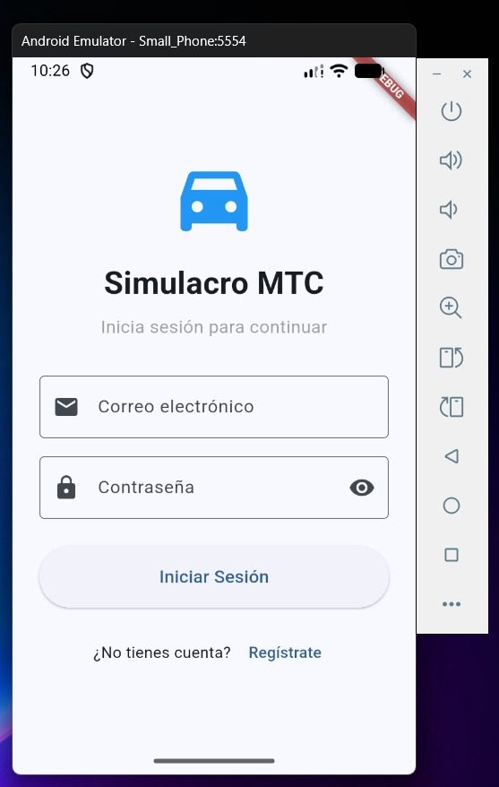
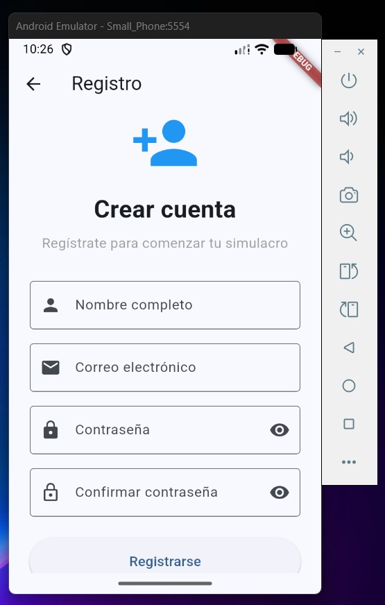
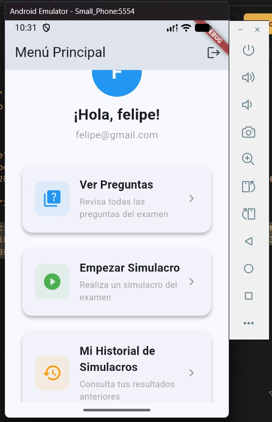
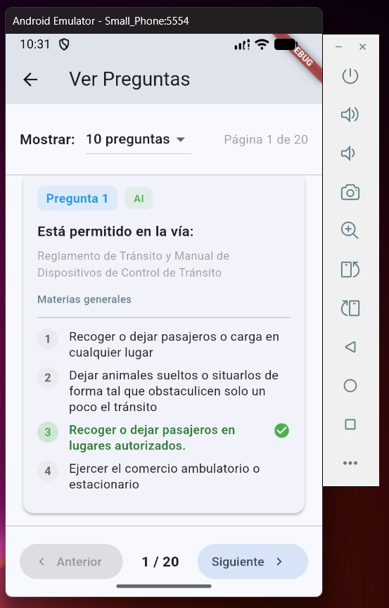
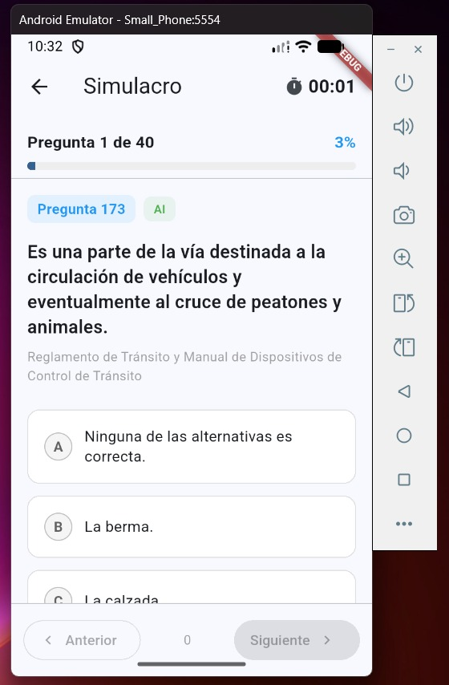
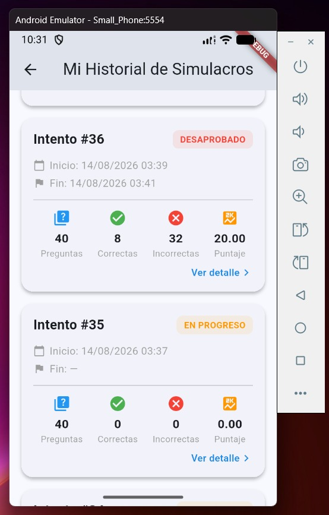
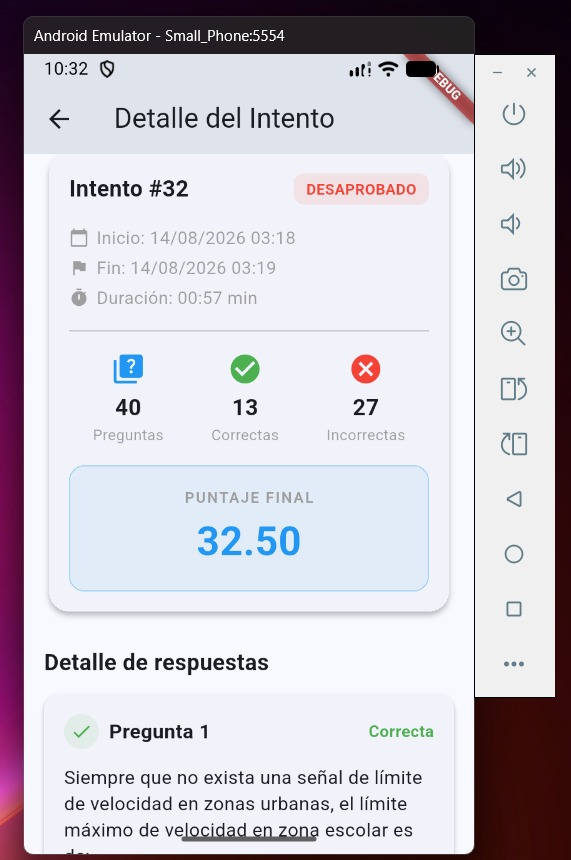
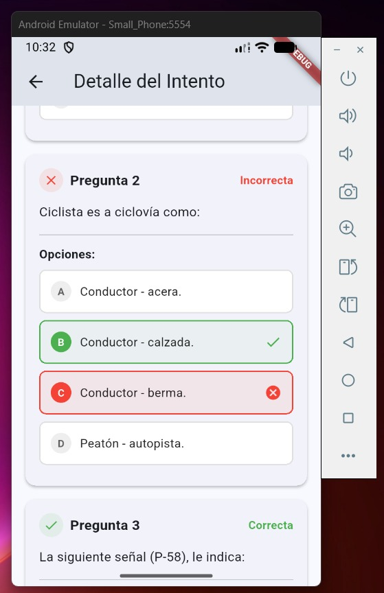

# Simulacro MTC

Aplicación móvil desarrollada en **Flutter** para la preparación del examen de licencia de conducir del **Ministerio de Transportes y Comunicaciones (MTC)** del Perú.

## 🎯 ¿Para qué sirve?

La aplicación permite a los postulantes practicar y evaluar sus conocimientos antes de rendir el examen oficial de manejo. Sus principales funcionalidades son:

- **Ver Preguntas**: Explora el banco de preguntas del examen, filtradas por categoría de licencia, con sus opciones y respuestas correctas.
- **Empezar Simulacro**: Realiza un simulacro completo del examen con cronómetro, navegación entre preguntas y guardado automático de respuestas.
- **Mi Historial de Simulacros**: Consulta los resultados de simulacros anteriores, incluyendo puntaje, aprobación y detalle de cada intento.
- **Autenticación**: Registro e inicio de sesión de usuarios para guardar su progreso y resultados.

## 📷 Capturas de pantalla

### Autenticación

| Iniciar Sesión | Registro |
|:---:|:---:|
|  |  |

### Menú principal

| Menú Principal |
|:---:|
|  |

### Ver Preguntas

| Banco de preguntas |
|:---:|
|  |

### Simulacro

| Simulacro del examen |
|:---:|
|  |

### Historial de Simulacros

| Mi Historial | Detalle del Intento |
|:---:|:---:|
|  |  |
|  | |

## 🛠️ Recursos utilizados

### Tecnologías y dependencias

| Recurso | Versión | Uso |
|---------|---------|-----|
| [Flutter](https://flutter.dev/) | SDK ^3.11.4 | Framework de desarrollo multiplataforma |
| [Dart](https://dart.dev/) | ^3.11.4 | Lenguaje de programación |
| [flutter_riverpod](https://pub.dev/packages/flutter_riverpod) | ^2.6.1 | Manejo de estado (StateNotifier, FutureProvider) |
| [http](https://pub.dev/packages/http) | ^1.2.2 | Cliente HTTP para consumir la API REST |
| [shared_preferences](https://pub.dev/packages/shared_preferences) | ^2.3.3 | Almacenamiento local de la sesión (token y usuario) |
| [flutter_dotenv](https://pub.dev/packages/flutter_dotenv) | ^5.1.0 | Gestión de variables de entorno |
| [flutter_lints](https://pub.dev/packages/flutter_lints) | ^6.0.0 | Reglas de análisis estático de código |

### Plataformas soportadas

- Android
- iOS
- Web
- Windows
- macOS
- Linux

## 📁 Estructura del proyecto

```
lib/
├── main.dart                     # Punto de entrada y AuthGate (control de sesión)
├── models/                       # Modelos de datos
│   ├── attempt.dart              # Intento de simulacro
│   ├── question.dart             # Pregunta y opciones
│   ├── question_page.dart        # Paginación de preguntas
│   ├── simulacrum_data.dart      # Datos del simulacro (intento + preguntas)
│   └── user.dart                 # Usuario autenticado
├── providers/                    # Manejo de estado con Riverpod
│   ├── attempt_provider.dart     # Historial y detalle de intentos
│   ├── auth_provider.dart        # Autenticación y sesión
│   ├── question_provider.dart    # Listado de preguntas paginado
│   └── simulation_provider.dart  # Lógica del simulacro
├── screens/                      # Pantallas de la aplicación
│   ├── attempt_detail_screen.dart # Detalle de un intento
│   ├── history_screen.dart       # Historial de simulacros
│   ├── home_screen.dart          # Menú principal
│   ├── login_screen.dart         # Inicio de sesión
│   ├── questions_screen.dart     # Ver preguntas
│   ├── register_screen.dart      # Registro de usuario
│   └── simulation_screen.dart    # Simulacro del examen
└── services/                     # Capa de servicios (API y almacenamiento)
    ├── attempt_service.dart      # Consumo de la API de intentos
    ├── auth_service.dart         # Consumo de la API de autenticación
    ├── question_service.dart     # Consumo de la API de preguntas
    ├── session_expired_exception.dart # Excepción de sesión vencida
    ├── session_manager.dart      # Gestión de expiración de sesión (navegación global)
    └── storage_service.dart      # Persistencia local de la sesión
```

## 🔐 Manejo de sesión

- El token de autenticación se almacena de forma local con `shared_preferences`.
- Si la API responde con código `401` y el error `ERROR_NO_VALID_TOKEN` (token vencido), la aplicación:
  1. Elimina la sesión local (token y usuario).
  2. Redirige automáticamente al login mediante un `navigatorKey` global.

## ⚙️ Configuración

1. Copia el archivo `.env.example` a `.env`:
   ```bash
   cp .env.example .env
   ```
2. Configura la URL de la API:
   ```
   API_URL=http://localhost:4005/api
   ```

## 🚀 Ejecución

```bash
flutter pub get
flutter run
```

## ✅ Análisis estático

```bash
flutter analyze